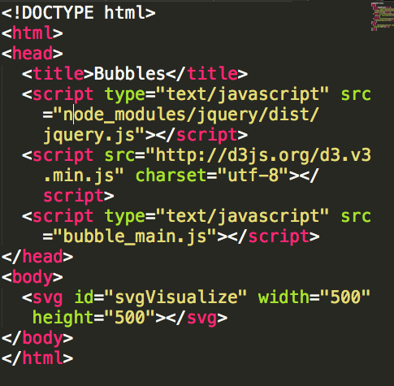
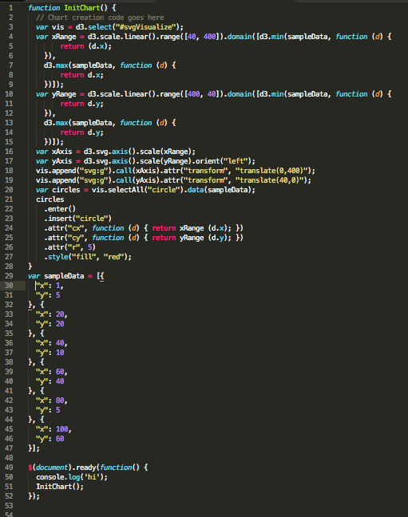
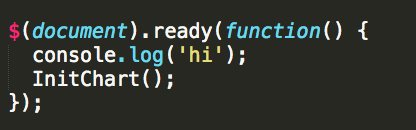
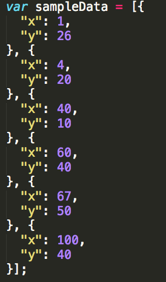
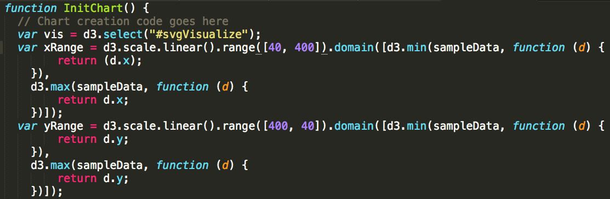
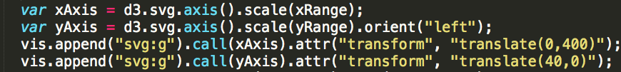
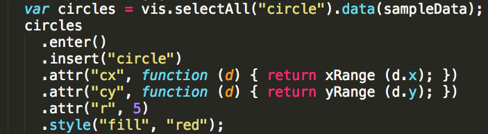

**TO MAKE A BUBBLE CHART**

This is what you want on the bubble html

For this example, in the scripts we are using JQuery, d3, and our linked sheet which we will get to next. In the body, there is a single element, an svg tag, which we will be appending to through javascript in the bubble_main.js.

SVG stands for scalable vector graphics - we are using it to generate an image on the page which we will be able to edit using XML.

ONTO the javascript:

That's a lot! Let's break it down.

Over here we're making sure things are linked, and calling the function we're about to make that will create the chart

Before we call the function, let's get some data up here. The x value represents how many times I try to pick up my cat, and the y value represents how many scratches I get as a result. Sometimes he's ornery, and sometimes he's sleepy, so the results vary.

FROM HERE ON OUT, everything is withing the Initialize function!

First, we're going to select the element we made in the html file.
Next we're going to define the ranges. There are two very important distinctions here, ranges and domains. The domain is what you'd expect a 'range' to be, it's the minimum and maximum value for values. To get the min and max values to use for the domain, we're going to call d3.max and d3.min on our array of sample data to find the largest and smallest value to use for max and min. We're also going to determine the range, which is the amount of space we are going to use to put the values from the domain in. once we have both the range and domain, we're going to call d3.scale.linear() on all of that to plot the graph. 

Next, we're going to use d3.svg.axis().scale() with the ranges we defined before. This will set the axis with what we've just defined before with the xRange and yRange. When we do this, there are more options for us to orient this. The ‘g’ element is a container element for grouping together related graphics elements. When we're appending it, we append it with that, then .call the axis we defined above. .call will call it on all the tick marks being used on each axis, and then it will add the transform attribute to each group of data (defined with the g). The translate will actually be changed to reflect the points in the axis ticker data.

Alright, last step is making the points of data viewable. Our graph is still not rendered, because it is waiting to be told what the pieces of data from sampleData are going to be displayed as. calling var cicles like this will make sure they're circles (we could instead make them rectangles, or all sorts of other things). We use .enter().insert('circle') to add them in, and then we need to set the attributes for where the circle x and y values are, what the style is, and what the radius is.

[Here's the result!](../bubble_chart.html)}

